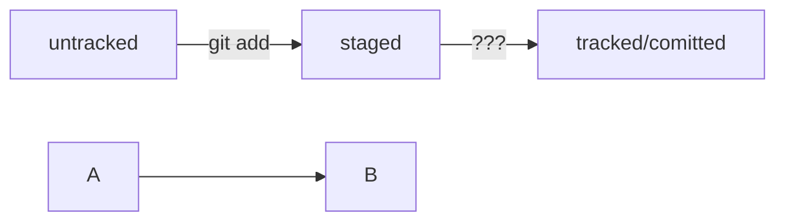

# Работа с Git и Github

## Создание локального репозитория:
```git init``` – инициализировать репозиторий;  
```git status``` – проверить статус, или состояние, репозитория;  
Если вы ошиблись и случайно инициализировали не ту папку, можно «разгитить» её — удалить скрытую подпапку .git.  

## Коммит:
```git add --all``` – подготовка к сохранению сразу всех файлов;  
```git commit -m 'Мой первый коммит!'```;  
```git log``` – история коммитов.  

## Связь локального репозитория с Github:
```git remote add origin git@github.com:%ИМЯ_АККАУНТА%/first-project.git``` – привязать удалённый репозиторий к локальному;  
origin — стандартный псевдоним, с помощью которого можно обращаться к главному удалённому репозиторию (обычно такой репозиторий один). Это значительно упрощает работу;  
```git remote -v``` – проверка, что репозитории связаны;  

## Коммит и пуш:
```git add --all``` – выбираем все файлы;  
```git commit -m 'Добавил обработку ошибок'``` – коммит с комментарием;  
```git push -u origin main``` – при ошибке заменить main на master. Отправляет изменения на Github, при повторных пушах «git push».

# Файл HEAD

Утверждения о HEAD:  
Это файл в папке .git, в котором записана ссылка (или ссылка на ссылку) на последний коммит;  
Это синоним хеша последнего коммита — его можно передавать командам Git в качестве параметра.

# Оформление сообщений к коммитам

Чтобы упростить работу, команды или даже целые компании часто договариваются об определённом стиле (то есть о правилах) оформления сообщений коммитов.  
Например, правила могут быть такие:
- длина сообщения от 30 до 72 символов;  
- первое слово — глагол в инфинитиве («исправить», «дополнить», «добавить» и другие);  
и так далее.

